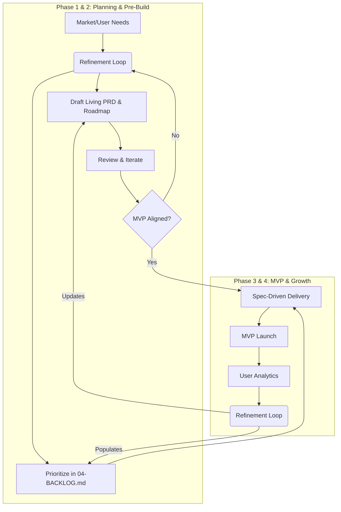

# Product Manager Workflow Audit

**Auditor:** Principal Product Manager
**Scope:** Zero Two One Framework - Product Management & Lifecycle Governance

## 1. Framework Baseline

From a product management perspective, the framework provides a structured pathway from ideation to delivery. Below is the baseline mapping of our core product tools and workflows.

### Key Product Documents
| Document | Purpose | Ownership |
|---|---|---|
| `README.md` | Status of the project (Lifecycle, Roadmap, Specs, Feedback). | Product Management |
| `01-PRD.md` | Defines the What & Why (modules, personas, success metrics). | Product Management |
| `03-ROADMAP.md` | Sequences the delivery milestones and phases. | Product Management |
| `04-BACKLOG.md` | Captures and prioritizes refinement tasks, features, bugs. | Product Management |
| `_refinement/` | The feedback synthesis engine during the entire lifecycle. | Cross-functional |

### Workflow Mapping

## 2. Audit Findings

**What Works Well:**
*   **Living Documents:** The fact that PRD, EDD, and TDD remain living documents throughout the product lifecycle with changelogs prevents artificial "freezes" and allows the product to pivot gracefully based on market feedback.
*   **The Refinement Gate:** The strict policy that no code lands without an approved spec provides incredible control over scope creep.

**Inconsistencies & Gaps:**
*   **Tracking Artifact:** The `04-PROJECT-TRACKING.md` was intended for pre-MVP tasks. We need a persistent `04-BACKLOG.md` to track refinement tasks, feature enhancements, and bugs across the entire lifecycle.
*   **Review Efficiency:** In the review process, there's no standardized process for the team to add CHANGE notes directly to a document to have those changes immediately become part of the current review round.

## 3. Proposed Changes

### High Priority
*   **Formalize `04-BACKLOG.md`:** Rename and reposition the tracking document to `requirements/04-BACKLOG.md` as the universal intake for tasks across all lifecycle phases.
*   **Standardize CHANGE Notes:** Introduce a protocol for inline CHANGE notes during refinement reviews.
*   **Elevate README.md:** Mandate that the `README.md` serves as the primary dashboard indicating the project's current lifecycle phase, active specs, and feedback rounds.

### Medium Priority
*   **Backlog Context Generation:** Update the SpecKit context builder (`scripts/speckit/fetch-speckit-context.js`) to ingest `04-BACKLOG.md` alongside the living PRD when generating feature specs.

### Low Priority
*   **Roadmap Automation:** Link the `03-ROADMAP.md` more tightly to GitHub milestones so that SpecKit completion automatically updates the roadmap artifact.

## 4. Implementation Considerations

*   **New Projects:** For net-new products, keeping the PRD living but relying on the Backlog for SpecKit implementation provides flexibility while maintaining strict delivery gates.
*   **Existing Legacy Projects:** We need a "Baseline Extraction" AI skill that reads an existing product and reverse-engineers a "Living PRD" and an initial `04-BACKLOG.md`, allowing them to adopt the Refinement Loop natively.
