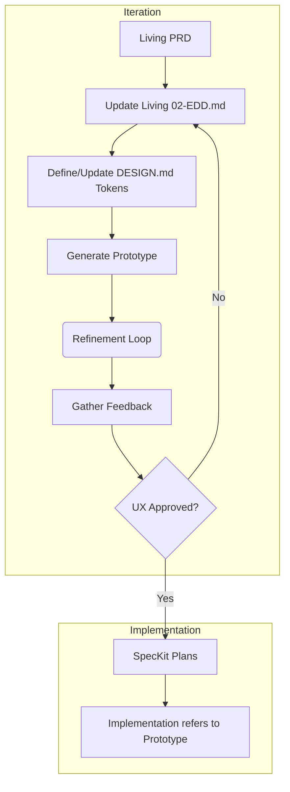

# UX Designer Workflow Audit

**Auditor:** Principal UX Designer
**Scope:** Zero Two One Framework - Experience Design, Prototyping, & Design Systems

## 1. Framework Baseline

The framework separates the *definition* of the experience from the *implementation* of the experience, using a static prototype as the central source of truth for stakeholder alignment.

### Key UX Documents & Tools
| Component | Purpose | Ownership |
|---|---|---|
| `02-EDD.md` | Experience Design Document (UX Strategy, Journey maps). | UX Design |
| `DESIGN.md` | Machine-readable design tokens (Colors, Typography, Spacing). | UX Design |
| `prototype/` | Static HTML/CSS/JS representation of the PRD/EDD. | UX Design (via AI) |

### UX Workflow Mapping

## 2. Audit Findings

**What Works Well:**
*   **Prototype as a Contract:** Forcing the creation of a static `prototype/` in Phase 2 before React/Backend code is written is fantastic.
*   **Living UX Strategy:** Because the `02-EDD.md` remains a living document throughout the entire product lifecycle, we can continuously update our UX strategy based on user analytics without conflicting with locked specs.

**Inconsistencies & Gaps:**
*   **Design System Integration:** The audit notes suggest a formal design system may be added to replace `DESIGN.md` content. We need clarity on this transition path.
*   **Prototype Post-MVP:** The framework currently lacks explicit guidance on prototype maintenance post-MVP. Do we continue maintaining it during the Growth phase?

## 3. Proposed Changes

### High Priority
*   **Design System Policy:** Update documentation to clarify how an external or more robust Design System can officially replace the content of `DESIGN.md`.
*   **Post-MVP Prototype Policy:** Explicitly state whether `prototype/` is deprecated after Phase 3 or if it should be maintained as a visual sandbox for the living `02-EDD.md`.

### Medium Priority
*   **UX QA Integration:** Add a specific step in `scripts/qa.sh` that utilizes an AI vision model (or visual regression testing) to compare the rendered SpecKit components against the rules defined in `DESIGN.md`.

### Low Priority
*   **Inline CHANGE Notes:** Adopt the new standardized process for inline CHANGE notes to make UX review rounds faster and more directly tied to the `02-EDD.md` text.

## 4. Implementation Considerations

*   **New Projects:** The `02-EDD.md` and `DESIGN.md` must be extremely robust before exiting Phase 2. The AI relies heavily on these to style the MVP accurately.
*   **Existing Legacy Projects:** Integrating this into a project with an existing CSS codebase requires an AI skill that scans the legacy CSS/components and extracts them into a normalized `DESIGN.md` (or Design System equivalent).
