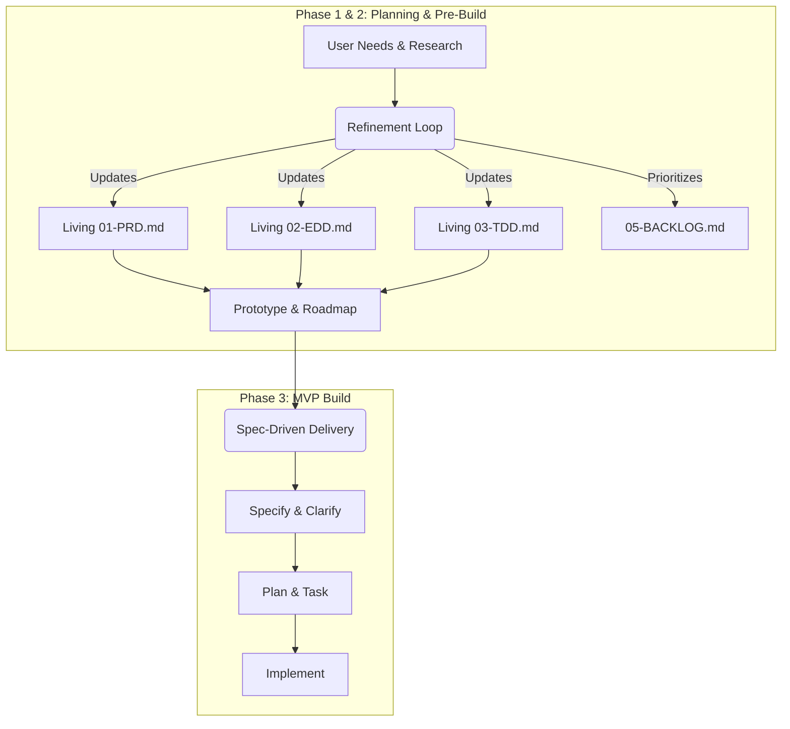
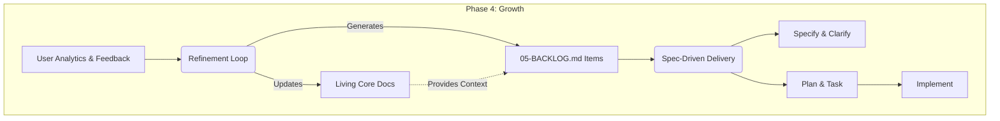

# Zero Two One: Workflow Audit & Enhancements

**Date:** July 2026
**Auditors:** Principal Product Manager, Principal Fullstack Engineer, Principal UX Designer
**Scope:** Review of the Zero Two One framework workflows, identifying gaps compared to the desired product lifecycle, and proposing upgrades (codenamed "021-updates").

---

## 1. Baseline Structure Outline

To establish a shared understanding, below is the current state of the framework's architecture, including its documents, workflows, and tools.

### 1.1 Guiding & Key Documents

| Type        | Document                     | Description                                               |
| ----------- | ---------------------------- | --------------------------------------------------------- |
| **Guiding** | `CLAUDE.md`                  | AI assistant context and high-level project instructions. |
| **Guiding** | `CODE.md`                    | Basic coding principles and tech stack (informs constitution). |
| **Guiding** | `PRODUCT.md`                 | Formalizes the step-by-step lifecycle workflow. |
| **Guiding** | `DESIGN.md`                  | Machine-readable design tokens, palettes, and typography. |
| **Key Doc** | `README.md`                  | Project status summary (Lifecycle phase, Roadmap Phase, specs, feedback). |
| **Key Doc** | `requirements/01-PRD.md`     | Product Requirements Document (What & Why).               |
| **Key Doc** | `requirements/02-EDD.md`        | Experience Design Document (How - Experience).            |
| **Key Doc** | `requirements/03-TDD.md`     | Technical Design Document (How - Technical).              |
| **Key Doc** | `requirements/04-ROADMAP.md` | Phased plan with milestone gates.                         |
| **Key Doc** | `requirements/05-BACKLOG.md` | Captures and prioritizes tasks, features, bugs across the lifecycle. |

*Note: The deprecated `docs/` folder has been removed, as its contents were migrated to `workflow/`.*

### 1.2 Core Workflows

| Workflow | Primary Phases | Purpose |
|---|---|---|
| **The Refinement Loop** | Planning, Pre-build, Growth | Core loop for gathering feedback, planning updates, and updating project-level docs. PRD, EDD, and TDD remain living documents throughout the lifecycle, with changelogs tracking updates. |
| **Spec-Driven Delivery** | MVP Build, Growth | Tactical delivery mechanism via GitHub Spec Kit (`specs/NNN-feature`). Follows: Specify → Clarify → Plan → Task → Analyze → Implement. |

### 1.3 Tools & Automation

| Tool / Script | Purpose |
|---|---|
| `Claude Code` | **Required Dependency.** AI agent executing the workflows. |
| `GitHub SpecKit` | **Required Dependency.** Provides specification workflow pipelines. |
| `npm run status` | Detects and outputs the current lifecycle phase. |
| `npm run qa` | Executes phase-appropriate checks (docs, prototype, unit, a11y, specs). |
| `hooks/pre-commit` | The Refinement Gate. Blocks implementation code if specs aren't approved. |
| `npm run spec:verify`| Validates spec compliance (artifact completeness, clarification limits, etc). |

---

## 2. Product Lifecycle & Workflow Cascades

The framework spans four distinct product lifecycle phases. The Refinement Loop maintains the core documents as **living documents** throughout the entire lifecycle.

### Planning, Pre-Build, and MVP Phases
In the early stages, the Refinement Loop governs the evolution of the core documents, establishing a solid foundation.

### Growth Phase
Post-MVP, the core documents remain living. The Refinement Loop continues to update them while heavily populating the backlog with enhancements and bugfixes for Spec-Driven Delivery.

---

## 3. Audit Findings (Cross-Functional Perspectives)

The team reviewed the current repository state against the intended workflow mechanics.

### 🎯 Principal Product Manager
**Focus:** Alignment, lifecycle gates, backlog prioritization, and requirements tracing.

* **What works well:** The strict "Refinement Gate" preventing code without approved specs ensures engineering doesn't drift from product intent. Keeping PRD as a living document prevents artificial documentation freeze.
* **Inconsistencies & Gaps:** The transition from `04-PROJECT-TRACKING.md` to a persistent `05-BACKLOG.md` needs formalization. The backlog must act as the intake engine throughout the entire lifecycle.
* **Conflicts:** In the review process, there's no standardized way to add CHANGE notes directly to a document to incorporate them into the current review round seamlessly.

### 💻 Principal Fullstack Engineer
**Focus:** CI/CD, technical debt, implementation velocity, and spec compliance.

* **What works well:** The `.ai/context/` bundling and `pre-commit` hooks are exceptional. The fact that the TDD remains a living document allows for proper architectural evolution and tech debt tracking in Phase 4.
* **Inconsistencies & Gaps:** Naming conventions (`AI_CODING_GUIDELINES.md`) do not align with the standard we want (`CODE.md`). The SpecKit constitution needs to explicitly source from `CODE.md`.
* **Conflicts:** With core docs evolving continuously, SpecKit features might generate specs based on an outdated version of the TDD if they branch off too early.

### 🎨 Principal UX Designer
**Focus:** Design systems, prototype fidelity, UX strategy, and user feedback integration.

* **What works well:** Building the static prototype *before* Speckit Implementation aligns stakeholders visually. The `02-EDD.md` remains living, allowing global UX patterns to evolve post-MVP.
* **Inconsistencies & Gaps:** We need to explicitly state whether a formal design system will replace `DESIGN.md` content, and clarify prototype maintenance post-MVP.

---

## 4. Proposed Changes

Based on the audit, here are the tiered recommendations to upgrade the framework (021-upgrades).

### 🔴 High Priority

1. **Rename & Formalize Guiding/Key Docs:**
   * Rename `AI_CODING_GUIDELINES.md` to `CODE.md` and explicitly link it to the SpecKit constitution.
   * Rename `LIFECYCLE_WORKFLOW.md` to `PRODUCT.md`.
   * Formalize `CLAUDE.md`, `CODE.md`, `PRODUCT.md`, and `DESIGN.md` as the core Guiding Docs.
   * Elevate `README.md` to a Key Doc detailing project status.
2. **Formalize the Universal Backlog:**
   * Rename `requirements/04-PROJECT-TRACKING.md` to `requirements/05-BACKLOG.md` to capture and prioritize tasks, features, and bugs continuously across all lifecycle phases.
3. **Standardize CHANGE Notes:**
   * Introduce a standardized process for the team to add CHANGE notes directly to a document to ensure those changes are integrated into the current review round.
4. **Remove the "Lock" Concept:**
   * Ensure all documentation clearly states that PRD, EDD, and TDD remain living documents throughout the lifecycle, utilizing changelogs at the bottom of the docs for tracking.

### 🟡 Medium Priority

1. **Dependency Enforcement:**
   * Update documentation and initializers to make Claude Code and GitHub SpecKit required dependencies.
2. **Context Resolution Updates:**
   * Modify the `.ai/context/` generator to ensure it correctly pulls from the newly renamed `CODE.md`, `PRODUCT.md`, and `05-BACKLOG.md`.

### 🟢 Low Priority

1. **Clean up Deprecated Folders:**
   * Remove the legacy `docs/` folder from the repository root since its contents have been migrated to `workflow/`.

---

## 5. Initialization Considerations

When initializing this updated framework, consider the origin state of the project.

### For New Projects (Point Zero)
* **Smooth Onboarding:** The clear separation of Guiding Docs vs Key Docs makes it easy to set the AI context immediately.

### For Existing Projects (Mid-Flight)
* **Adoption Friction:** We must generate an "Initialization Spec" to help existing projects draft their initial living `01-PRD.md`, `03-TDD.md`, and `05-BACKLOG.md` based on their current codebase, effectively bootstrapping them into the Refinement Loop.
