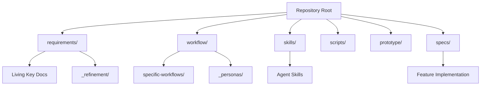

# Zero Two One Manifest & Workflows

> The central manifest for this framework. It outlines the project's folder and document structure, and acts as an index to the modular workflows that govern **Discovery, Design, Refinement, Speckit Implementation, QA, and Release** across the product lifecycle.

---

## 1. Project Architecture

The repository is structured into distinct domains that separate requirements, implementation, and agentic workflows.

---

## 2. Document Manifest

### Root Directory
| File | Purpose |
|---|---|
| `CLAUDE.md` | Assistant instructions and project guidelines (the default `claude` stack's rendering; other stacks render `AGENTS.md` or steering files — TDD §9). |
| `CODE.md` | Basic coding principles and tech stack (informs constitution). |
| `PRODUCT.md` | Formalizes the step-by-step lifecycle workflow. |
| `DESIGN.md` | Machine-readable design tokens, palettes, and typography. |
| `README.md` | Project status summary and entry point. |

### `requirements/`
The core documentation that defines the product. These are **living documents** throughout the entire lifecycle.

| File/Folder | Purpose |
|---|---|
| `01-PRD.md` | Product Requirements Document (What & why — modules, scenarios, data model). |
| `02-EDD.md` | Experience Design Document (How - Experience). |
| `03-TDD.md` | Technical Design Document (Architecture overview + locked decisions). |
| `01-PRD.md` + `02-EDD.md` + `03-TDD.md` | Treated as **one cohesive set** (r4) — every surface referencing one includes all three. |
| `05-ROADMAP.md` | Release-based plan: MVP releases now, Growth releases post-transition; summaries link to `_releases/`. |
| `04-BACKLOG.md` | Planned backlog and project tracker. |
| `_design/` | Holds design assets. |
| `_notes/` | Unstructured research, analysis and background context. |
| `_refinement/` | Tracks the refinement loop cycles (`r{x}-review.md`). |
| `_releases/` | One file per roadmap release (`mvp-N.md`, `v1.x-<theme>.md`) — goal, promoted items, delivered summary (r4). |

### `workflow/`
Documentation defining the overall project workflow and personas involved.

| File/Folder | Purpose |
|---|---|
| `workflows.md` | This file. Canonical expanded workflow reference and project manifest. |
| `specific-workflows/` | Sub-folder for specific, modular workflows. |
| `_personas/` | Personas for users, stakeholders, and contributors. |

### `skills/` & `scripts/`
AI prompts, skills, and tools used for generating project artifacts and driving Speckit implementation.

| File/Folder | Purpose |
|---|---|
| `skills/tools.json` | Agent tool schemas (`fetch_speckit_context`, `verify_spec_compliance`, etc.). |
| `skills/*.md` | Specific prompts (e.g., `generate-frontend-component.md`, `check-framework-compliance.md`). |
| `scripts/workflow-status.js` | Detects the current lifecycle phase. |
| `scripts/speckit/` | SSD engine tooling — spec status management, context bundle generation, compliance verification. |
| `hooks/pre-commit` | The refinement gate — blocks implementation commits on feature branches. |

### Other Directories
| Folder | Purpose |
|---|---|
| `.github/` | GitHub-specific configurations and templates (`ISSUE_TEMPLATE/`). |
| `.ai/context/` | Generated AI artifacts (gitignored) like Speckit context bundles (`NNN-feature-name.md`). |
| `prototype/` | Optional static prototype (added via `021-prototype`, r5) that aligns with the PRD/EDD and `DESIGN.md`. |
| `specs/` | Canonical SpecKit specs, feature-level implementation details, and validation rules. |
| `templates/` | Templates for creating standardized project documentation (`01-PRD-Template.md`, etc.). |

---

## 3. Modular Workflows

The framework's operations are broken down into specific workflows:

### Core Workflows
- **[Product Lifecycle (PLC)](file:///Users/williamdingwall/Sites/zero-two-one/workflow/specific-workflows/product-lifecycle.md):** The overarching 3-phase lifecycle of the product.
- **[The Refinement Loop (RLP)](file:///Users/williamdingwall/Sites/zero-two-one/workflow/specific-workflows/refinement-loop.md):** The project-level change-control loop for maintaining living documents and the backlog.
- **[Spec-Driven Delivery (SSD)](file:///Users/williamdingwall/Sites/zero-two-one/workflow/specific-workflows/spec-driven-delivery.md):** The tactical delivery mechanism utilizing GitHub Spec Kit and the Refinement Gate.
- **[Init & Migration (INM)](file:///Users/williamdingwall/Sites/zero-two-one/workflow/specific-workflows/init-and-migration.md):** How the framework lands in a target repository — fresh scaffolds and non-destructive migrations into working projects.
- **[Design-System Selection (DSS)](file:///Users/williamdingwall/Sites/zero-two-one/workflow/specific-workflows/design-system-selection.md):** Adopting or switching a design system — assessment, token mapping, and cascade into the EDD and prototype.

### Refinement sync sub-workflows (r6 — mechanics of the Refinement Loop)
- **[review-sync](specific-workflows/review-sync.md):** Review → per-doc update plans.
- **[requirements-sync](specific-workflows/requirements-sync.md):** Apply approved plans to the key docs; cohesion cross-check.
- **[guidance-sync](specific-workflows/guidance-sync.md):** Keep the guiding/role docs aligned with the key docs.
- **[prototype-sync](specific-workflows/prototype-sync.md):** Keep an existing prototype in sync (optional).
- **[backlog-sync](specific-workflows/backlog-sync.md):** Key-doc/review changes → `04-BACKLOG` table rows.
- **[release-sync](specific-workflows/release-sync.md):** Maintain the canonical `_releases/` files.
- **[roadmap-sync](specific-workflows/roadmap-sync.md):** Surface releases onto `05-ROADMAP` as a view.

### Transitional Flows
- **[Planning > MVP Build (P2M)](specific-workflows/planning-to-mvp.md):** How the workflows shift when the Planning sign-off milestone passes (r6).
- **[MVP > Growth Transition (MGT)](specific-workflows/mvp-to-growth-transition.md):** How the roadmap and backlog change roles when the product leaves MVP and enters Growth.
- **[Release Launch](specific-workflows/release-launch.md):** Verify, publish, and record a completed release (r6).
- **[Key Docs > Prototype](specific-workflows/key-docs-to-prototype.md):** How the living documents drive an **optional** prototype, generated on demand via `021-prototype` (Planning).
- **[Key Docs > Roadmap > Backlog > SSD](specific-workflows/key-docs-to-ssd.md):** How high-level definitions mechanically translate into actionable code.
- **[Review > Backlog > SSD](specific-workflows/review-to-ssd.md):** How user feedback and analytics continuously cycle into the development pipeline.

---

## 4. Dependencies & Automation

The framework relies on the project's configured **stack** — the AI assistant + SSD engine pairing recorded in `.zero-two-one.json` (default stack `claude` = Claude Code + GitHub Spec Kit; see TDD §9 for the `antigravity` and `kiro` stacks). Process docs name roles, with defaults in parentheses; only the manifest and TDD §9 bind tools normatively.

All framework commands follow the zero-two-one naming convention (`021-` namespace — see `CODE.md`):

| Command | Purpose |
|---|---|
| `npx zero-two-one-init [dir]` | Scaffold or migrate the framework into a repository |
| `npx 021 status` | Detect and print the current lifecycle phase |
| `npx 021 qa` | Phase-appropriate QA suite |
| `npx 021 spec status list` | All specs with status and gate state |
| `npx 021 spec status set <spec> <status>` | Advance a spec's lifecycle |
| `npx 021 spec context` | Generate `.ai/context/` bundles for the active feature |
| `npx 021 spec verify` | Full spec compliance audit (`--gate` for the fast subset, `--json` for agents) |
