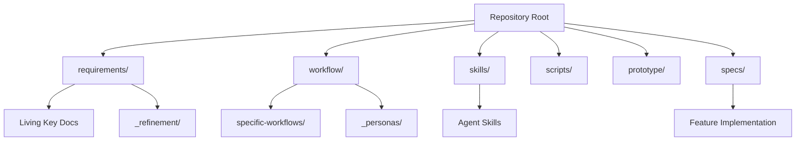

# Zero Two One Manifest & Workflows

> The central manifest for this framework. It outlines the project's folder and document structure, and acts as an index to the modular workflows that govern **Discovery, Design, Refinement, Speckit Implementation, QA, and Release** across the product lifecycle.

---

## 1. Project Architecture

The repository is structured into distinct domains that separate requirements, implementation, and agentic workflows.

---

## 2. Document Manifest

### Root Directory
| File | Purpose |
|---|---|
| `CLAUDE.md` | AI Assistant Instructions and Project Guidelines. |
| `CODE.md` | Basic coding principles and tech stack (informs constitution). |
| `PRODUCT.md` | Formalizes the step-by-step lifecycle workflow. |
| `DESIGN.md` | Machine-readable design tokens, palettes, and typography. |
| `README.md` | Project status summary and entry point. |

### `requirements/`
The core documentation that defines the product. These are **living documents** throughout the entire lifecycle.

| File/Folder | Purpose |
|---|---|
| `01-PRD.md` | Product Requirements Document (What & why — modules, scenarios, data model). |
| `02-EDD.md` | Experience Design Document (How - Experience). |
| `03-TDD.md` | Technical Design Document (Architecture overview + locked decisions). |
| `04-ROADMAP.md` | Phased plan and milestone gates. |
| `05-BACKLOG.md` | Planned backlog and project tracker. |
| `_design/` | Holds design assets. |
| `_notes/` | Unstructured research, analysis and background context. |
| `_refinement/` | Tracks the refinement loop cycles (`r{x}-review.md`). |

### `workflow/`
Documentation defining the overall project workflow and personas involved.

| File/Folder | Purpose |
|---|---|
| `workflows.md` | This file. Canonical expanded workflow reference and project manifest. |
| `specific-workflows/` | Sub-folder for specific, modular workflows. |
| `_personas/` | Personas for users, stakeholders, and contributors. |

### `skills/` & `scripts/`
AI prompts, skills, and tools used for generating project artifacts and driving Speckit implementation.

| File/Folder | Purpose |
|---|---|
| `skills/tools.json` | Agent tool schemas (`fetch_speckit_context`, `verify_spec_compliance`, etc.). |
| `skills/*.md` | Specific prompts (e.g., `generate-frontend-component.md`, `check-framework-compliance.md`). |
| `scripts/workflow-status.js` | Detects the current lifecycle phase. |
| `scripts/speckit/` | Spec status management, context bundle generation, compliance verification. |
| `hooks/pre-commit` | The refinement gate — blocks implementation commits on feature branches. |

### Other Directories
| Folder | Purpose |
|---|---|
| `.github/` | GitHub-specific configurations and templates (`ISSUE_TEMPLATE/`). |
| `.ai/context/` | Generated AI artifacts (gitignored) like Speckit context bundles (`NNN-feature-name.md`). |
| `prototype/` | One cohesive static prototype that aligns with the PRD and TDD. |
| `specs/` | Canonical SpecKit specs, feature-level implementation details, and validation rules. |
| `templates/` | Templates for creating standardized project documentation (`01-PRD-Template.md`, etc.). |

---

## 3. Modular Workflows

The framework's operations are broken down into specific workflows:

### Core Workflows
- **[Product Lifecycle (PLC)](file:///Users/williamdingwall/Sites/zero-two-one/workflow/specific-workflows/product-lifecycle.md):** The overarching 4-phase lifecycle of the product.
- **[The Refinement Loop (RLP)](file:///Users/williamdingwall/Sites/zero-two-one/workflow/specific-workflows/refinement-loop.md):** The project-level change-control loop for maintaining living documents and the backlog.
- **[Spec-Driven Delivery (SSD)](file:///Users/williamdingwall/Sites/zero-two-one/workflow/specific-workflows/spec-driven-delivery.md):** The tactical delivery mechanism utilizing GitHub Spec Kit and the Refinement Gate.

### Transitional Flows
- **[Key Docs > Prototype](file:///Users/williamdingwall/Sites/zero-two-one/workflow/specific-workflows/key-docs-to-prototype.md):** How the living documents drive the initial prototype (Phases 1 & 2).
- **[Key Docs > Roadmap > Backlog > SSD](file:///Users/williamdingwall/Sites/zero-two-one/workflow/specific-workflows/key-docs-to-ssd.md):** How high-level definitions mechanically translate into actionable code.
- **[Review > Backlog > SSD](file:///Users/williamdingwall/Sites/zero-two-one/workflow/specific-workflows/review-to-ssd.md):** How user feedback and analytics continuously cycle into the development pipeline.

---

## 4. Dependencies & Automation

The framework heavily relies on **Claude Code** and **GitHub SpecKit** to operationalize these workflows.

| Command | Purpose |
|---|---|
| `npx zero-two-one-init [dir]` | Scaffold the framework into a repository |
| `npm run status` | Detect and print the current lifecycle phase |
| `npm run qa` | Phase-appropriate QA suite |
| `npm run spec:status -- list` | All specs with status and gate state |
| `npm run spec:status -- set <spec> <status>` | Advance a spec's lifecycle |
| `npm run spec:context` | Generate `.ai/context/` bundles for the active feature |
| `npm run spec:verify` | Full spec compliance audit (`--gate` for the fast subset, `--json` for agents) |
